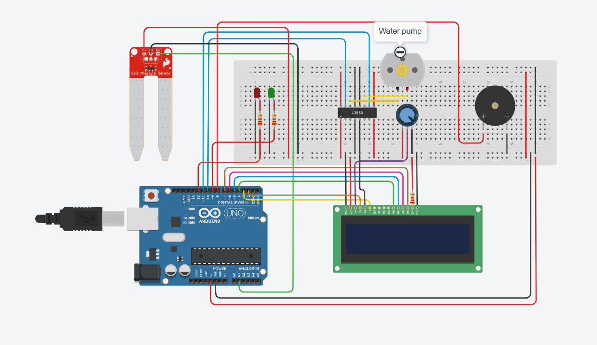

#  Smart Irrigation System Using Soil Moisture Sensor

##  Project Title
Smart Irrigation System to Optimize Water Usage in Agricultural Fields

---

##  Aim
To design and simulate a Smart Irrigation System that monitors soil moisture levels and automatically controls irrigation to optimize water usage and improve agricultural efficiency.

---

##  Problem Statement
Agriculture depends heavily on proper irrigation for healthy crop growth. Traditional irrigation methods often result in overwatering or underwatering due to manual control. Over-irrigation leads to water wastage, soil nutrient loss, and increased energy consumption, while under-irrigation reduces crop yield and affects plant health.

The objective of this project is to design and implement a Smart Irrigation System that automatically monitors soil moisture levels and activates irrigation only when required. The system aims to optimize water usage, reduce human intervention, and improve agricultural efficiency.

---

##  Proposed Solution
The proposed smart irrigation system continuously monitors the moisture level of the soil using a soil moisture sensor. The sensor outputs an analog signal proportional to the moisture content in the soil. This signal is read by the Arduino Uno.

The Arduino compares the sensor value with a predefined threshold value. Based on this comparison:

- If the soil moisture level is below the threshold (indicating dry soil), the Arduino activates the water pump through the L293D motor driver. The red LED turns ON, the buzzer produces an alert sound, and the LCD displays that the pump is ON.

- If the soil moisture level is above the threshold (indicating sufficient moisture), the Arduino turns OFF the water pump. The green LED turns ON, the buzzer remains OFF, and the LCD displays that the pump is OFF.

This automation ensures that irrigation occurs only when necessary, thereby conserving water and maintaining optimal soil conditions for plant growth.

---

##  Scope of the Solution
The smart irrigation system can be implemented in:

Small and medium-scale agricultural fields

- Greenhouses
- Home gardens
- Nurseries and plant research centers

The system can be further enhanced by:

- Integrating WiFi or GSM modules for remote monitoring
- Connecting to cloud platforms for data logging
- Adding temperature and humidity sensors
- Implementing multiple moisture sensors for different field zones
- Using solar power for energy-efficient operation
- Developing a mobile application for real-time monitoring and control

With these improvements, the system can be scaled for large agricultural applications and smart farming solutions. 

### Limitations:
- Soil moisture sensors may degrade over time due to corrosion.
- The threshold value requires manual calibration.
- The system does not consider weather conditions such as rainfall.
- It does not measure other environmental parameters like temperature and humidity.
- Requires continuous power supply.
- The current design is suitable mainly for small-scale applications unless further expanded.
---

## 🛠 Required Components

###  Hardware (Simulated in TinkerCAD)
- Arduino UNO
- Soil Moisture Sensor
- L293D Motor Driver IC
- Water Pump / DC Motor
- Breadboard
- Jumper Wires
- Power Supply
- 16x2 LCD Display
- Red LED
- Green LED
- Buzzer
- 220 ohm resistors (for LEDs)
- 10 kΩ Potentiometer  (for LCD contrast adjustment)

###  Software
- TinkerCAD (Circuit Simulation)
- Arduino IDE
- Embedded C/C++

---
## Simulated Circuit


##  Working Principle
1. Soil moisture sensor reads moisture level.
2. Arduino compares value with predefined threshold.
3. If soil is dry → Pump turns ON.
4. If soil is wet → Pump turns OFF.
5. Process repeats continuously.

---

##  Arduino Code

```cpp
#include <LiquidCrystal.h>

const int soilSensor = A0;

const int motor1 = 10;
const int motor2 = 11;

const int LedRed = 12;
const int LedGreen = 9;
const int Buzzer = 8;

LiquidCrystal lcd(2, 3, 4, 5, 6, 7);

int threshold = 600;   // Change after testing

void setup() {

  Serial.begin(9600);

  pinMode(motor1, OUTPUT);
  pinMode(motor2, OUTPUT);
  pinMode(LedRed, OUTPUT);
  pinMode(LedGreen, OUTPUT);
  pinMode(Buzzer, OUTPUT);

  lcd.begin(16, 2);
  lcd.print("Smart Irrigation");
  delay(2000);
  lcd.clear();
}

void loop() {

  int moistureValue = analogRead(soilSensor);

  // Convert to percentage
  int moisturePercent = map(moistureValue, 1023, 0, 0, 100);

  Serial.print("Moisture: ");
  Serial.println(moistureValue);

  lcd.setCursor(0,0);
  lcd.print("Moisture: ");
  lcd.print(moisturePercent);
  lcd.print("%   ");

  if (moistureValue > threshold) {

    // DRY SOIL
    digitalWrite(motor1, HIGH);
    digitalWrite(motor2, LOW);

    digitalWrite(LedRed, HIGH);
    digitalWrite(LedGreen, LOW);

    tone(Buzzer, 1000);

    lcd.setCursor(0,1);
    lcd.print("Pump: ON  ");

  } else {

    // WET SOIL
    digitalWrite(motor1, LOW);
    digitalWrite(motor2, LOW);

    digitalWrite(LedRed, LOW);
    digitalWrite(LedGreen, HIGH);

    noTone(Buzzer);

    lcd.setCursor(0,1);
    lcd.print("Pump: OFF ");
  }

  delay(1000);
}
```
---

## Project Details

**Project Title:** Smart Irrigation System to Optimize Water Usage in Agricultural Fields
**Developed By:** ASWIN BINU,ADLIN BENNY,IVAN CALTIN,ADRIEN SAMUEL 
**Register Number:** 2460610,2460604,2460620,2460605
**Department:** ECE 
**College:** CHRIST UNIVERSITY  
**Academic Year:** 2025–2026  
**Course Name:** AIIOT

---
